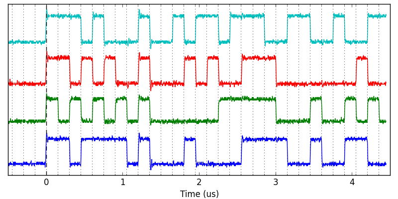
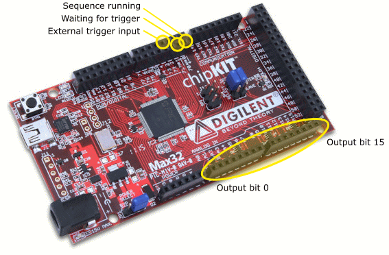

bitblaster: cheap, easy pulse generation
==========================================


Capabilities
-------------
The following capabilities are for the specific [chipKIT Max32][2] board.
Improved capabilities may be available on newer units, but see compatibility section.

- 3.3V LVTTL outputs, with 5V-compatible TTL inputs
- 16 simultaneous digital outputs
- Minimum pulse time 150ns, then 25ns increments (see timing information below)
- 128kB RAM, providing capability for 30,000 instructions
- Software- and hardware-triggering
- Supports mid-sequence "wait" commands to enable hardware re-triggering
- Powered by USB or external 5V
- USB interface, programmable over serial
- Python and [LabVIEW][6] interfaces provided (python included, [LabVIEW hosted separately][6])

The below graph demonstrates 4-channels of output, captured with a TekTronix TDS-2024 (voltage probes attenuation x10), with dashed lines corresponding to 150ns intervals.


The sequence was created using the following minimal example code
```python
import bitblaster, numpy
dev = bitblaster.BitBlaster('COM4') # open USB comm port
seq = numpy.random.randint(0,16,100) # a simple sequence
dev.bitstream(seq,dt=150e-9) # program the device
dev.start() # software-trigger, immediate start
```


Timing information
-------------------


Compatibility
--------------
The `bitblaster` is designed for the `chipKIT Max32` board which is based around a `PIC32MX795F512`, a 32-bit 80MHz microcontroller.
Currently the interrupt-handling behaviour is specific to the `PIC32MX`-series processors and not the `PIC32MZ`-series (such as the `chipKIT Wi-Fire`).
This may be addressed in the future.

Depending on the available RAM (and the memory layout algorithm of the compiler), the maximum number of instructions will change (the `MAX_INSTR` value).


Flashing the unit
------------------
**NOTE:** Presently code compatibility has some issues with different integrated IDEs because they contain different versions of the compilation toolchain.

It is _strongly_ recommended that you use [MPIDE-0023 v20120903][3]
The application currently uses a deprecated form of interrupt handling which may not compile correctly on newer versions.
Work to correct this is ongoing.

1.	Install your IDE/toolchain
2.	Disable compiler optimisations (see below)
3.	Open the sketch (the PDE file)
4.	Select Tools > Board > chipKIT MAX32
5.	Select Tools > Serial Port, and choose the corresponding port number
6.	Click the "Verify" button to compile and check there are no errors
7.	Click the "Upload" button to flash the unit.
	This takes ~30s, and the RX/TX lights will flash rapidly
8.	Click the "Serial Monitor" button and set the communication properties as below.
	The unit will not respond for ~5s, during which time the green "user LED" will flash at ~1Hz
9.	When the green LED stays on, the unit is ready for instruction, and will send the string `ready`
10.	Send the strings `hello` to check communications
11.	Use the strings `hi` and `lo` to check the outputs change correctly


Disabling compiler optimisations
----------------------------------
Aren't optimisations a good thing? **Why should they be disabled?**

The bitblaster uses custom assembly (ASM) to waste as few clock cycles as possible, in particular the [branch delay slot][5], which is typically avoided as it often produces unintended execution.
The order of the ASM instructions is very important for correct execution, and the compiler should not change that.
It can also make incorrect guessed about memory usage, which we have already addressed.

So please **disable optimisations as follows:**

1.	Navigate to `<MPIDE directory>/hardware/pic32`
2.	Edit each of the txt files in this directory to replace any instances of `-O2`, `-O3` or `-Os` with `-O0`
3.	Restart MPIDE
4.	`Shift+<click>` on "Verify" in MPIDE to compile with debug information, and check for "-O0" in the command log

The most common error when compiler optimisations have not been disabled is
```
[..]../../pic32mx/bin/ld.exe: function at exception vector 3 too large
```


Communication
--------------
The chipKIT has a USB-Serial FTDI bridge, which installs as a COM port.
The device accepts commands as specified below.

Serial communication is at 115200bps, ASCII-encoded with "CRLF" (`\r\n`) line termination.

Note that the device is RESET when comms are connected, and may take 10 seconds to become ready to accept commands.
The device will send the string `ready` when it is ready to accept communication.

| Command           | Response     | Purpose                                         |
|-------------------|--------------|-------------------------------------------------|
| `hello`           | `hello`      | No action, used to test comms                   |
| `go high` or `hi` | `ok`         | All bits in PORTB set HI                        |
| `go low` or `lo`  | `ok`         | All bits in PORTB set LO                        |
| `set I J K`       | `ok`         | Program element I to output J for K steps       |
| `get I`           | `J K`        | Get element I, J and K as per `set` command     |
| `start`           | `ok`..`done` | Software-trigger sequence to begin immediately  |
| `hwstart`         | `ok`..`done` | Begin the sequence on the next hardware trigger |
| `repeat`          | `ok`..`1`..  | Continuous outputs on a software trigger        |
| `hwrepeat`        | `ok`..`1`..  | Outputs the sequence on every hardware trigger  |
| `reset`           | `ok`         | Reboot the Max32 unit                           |

Note that the `start` and `hwstart` commands will respond immediately with `ok`, then send the string `done` when the sequence is complete.
During this time, no commands will be accepted, to ensure accurate timing of the execution of the sequence.

The convenience commands "repeat" and "hwrepeat" are provided for debugging, and will automatically continue to output the sequence.
The device will respond with the iteration number upon each completion.
Note that the device cannot recover from this mode as it will always be in "execution" state and never in the "ready and waiting" state.
Closing the comm port will reset the device.

**Moreover, any serial data received during this time will cause the unit to reset.**
The unit operates autonomously, and to prevent interfering with precise timing, this is the only (software) way to interrupt a running sequence.
For example, this can be used to prevent waiting forever for a missed trigger.
Hardware reset (through the RST pin or using the "Reset button" BTN1) is also possible at any time.


Pin assignment
---------------
See also the [chipKIT Max32 Pinout Table][2] for a list of the pins and their purposes.
Note that most pins can be configured for multiple purposes, the below table contains the non-trivial pin assignments set by this program.



| Connection  | Label   | Port    | Purpose                                     |
|:-----------:|:-------:|:-------:|---------------------------------------------|
| J14-02      | 70      | RA0     | "Running" monitor output                    |
| J14-04      | 71      | RA1     | "Waiting for trigger" monitor output        |
| J14-07      | 3       | INT0    | External trigger input                      |
| J5          | A0--A7  | RB0--7  | LO-byte of output buffer                    |
| J7          | A8--A15 | RB8--15 | HI-byte of output buffer                    |
| J3-13       | GND     |         | Ground                                      |
| J10-04      | GND     |         | Ground                                      |
| J10-03      | 5V0     |         | Supply voltage (5V regulated if JP1 is REG) |
| J10-02      | 3V3     |         | 3.3V regulated supply voltage               |


Operating principles
---------------------
The `bitblaster` is a single-threaded application that holds a buffer of instructions, describing the sequence that is desired to be executed.
The entire output port (PORTB) is written simultaneously on each update, and a counter is used to control the length of the instruction.

Time-critical components are coded in hand-optimised assembly (ASM) code to ensure reliable timing and reduce jitter.
Supported instructions can be found in the [Data Sheet, Chapter 3 (Instruction Set)][4].
Hardware triggering is handled by a hardware interrupt to ensure rapid response, optimised for the particular register layout of the PIC32MX.

Be sure to read and understand the [Data Sheet, Chapter 12 (I/O Ports)][4] before attempting to understand the code.

| Register | Purpose                                                                |
|:--------:|------------------------------------------------------------------------|
| `$t0`    | Pointer to the data output buffer (`LATB` register, outputs RB0--15)   |
| `$t1`    | Pointer to the monitor output buffer (`LATA` register, outputs RA0--1) |
| `$t2`    | Pointer to the current instruction in memory                           |
| `$t3`    | Number of timesteps remaining at this instruction                      |
| `$t4`    | Value of the output buffer desired for this instruction                |
| `$t6`    | Pointer to the interrupt control register (`IPC0`) for trigger control |
| `$t7`    | Temporary value                                                        |

Serial communication is handled by the high-level C++ Arduino library for simplicity.


[1]: http://chipkit.net/ "chipKIT homepage"
[2]: http://www.digilentinc.com/Products/Detail.cfm?Prod=CHIPKIT-MAX32 "Digilent chipKIT Max32 product page"
[3]: http://chipkit.s3.amazonaws.com/ "Archive of MPIDE versions"
[4]: http://ww1.microchip.com/downloads/en/DeviceDoc/PIC32MX_Datasheet_v2_61143B.pdf "PIC32MX Family Data Sheet"
[5]: https://en.wikipedia.org/wiki/Delay_slot#Branch_delay_slots
[6]: https://bitbucket.org/martijnj/bitblaster_labview/
